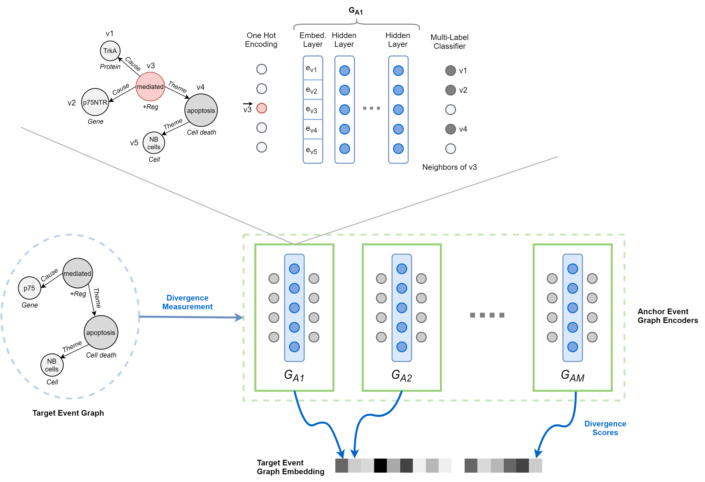
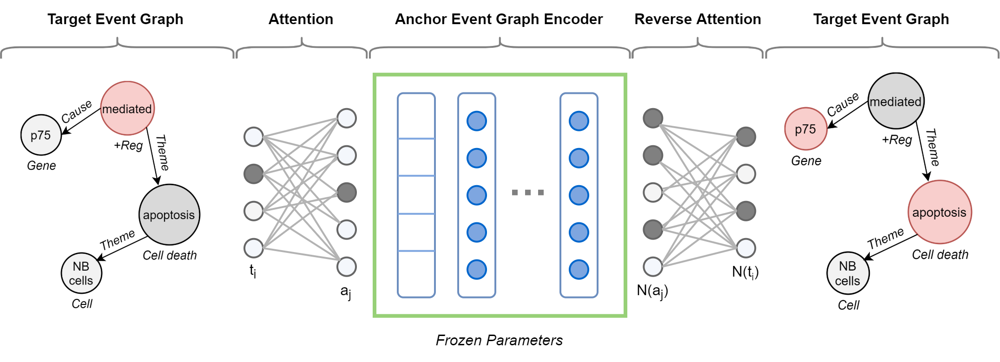

# DDEGK

Code and data accompanying the MDPI Sensors 2020 paper ["Unsupervised Event Graph Representation and Similarity Learning on Biomedical Literature"](TODO).

DDEGK is an unsupervised and inductive method capable of mapping events into low-dimensional vectors (task-agnostic and whole-graph embeddings), reflecting their structural and semantic similarities. It is designed to be highly interpretable, with a cross-graph isomorphic attention mechanism trained to preserve node and edge attributes. By merging deep learning architectures and natural language processing with symbolic structures and graph theory, it represents a powerful tool for automatically recognizing similarities between biomedical interactions mentioned by researchers in scientific publications, enabling their aggregation, quantification, and retrieval. It leverages deep graph kernel without requiring computing the entire kernel matrix, providing greater scalability. Specifically, DDEGK compares events against a small set of anchor ones, learning embeddings based on target-anchor divergences. Thus learned embeddings make event-centered operations simpler and faster than comparable operations on graphs.

## Overview


DDEGK overview. Structural and semantic divergence scores from a set of anchor event graphs are used to compose the vector representation of a target event graph. Divergence is measured through pre-trained Node-to-Edges encoder models, one for each anchor.

<br/>
<br/>


Anchor-based target event graph encoder for divergence prediction. Attention layers map the target event graph nodes onto the anchor graph, being aware of node and edge attributes.

## Datasets

We applied and evaluated DDEGK on nine real-world datasets originally designed for biomedical event extraction, mainly introduced by the ongoing BioNLP-ST series: ST09, GE11, EPI11, ID11, MLEE, GE13, CG13, PC13, and GRO13. Download [original corpora](https://drive.google.com/file/d/1e9SZgm2IMc9vMZ4b7aulYa5W8g24mLjh/view?usp=sharing) (≈6GB of uncompressed <.txt, .a1, .a2> files) and [samples](https://drive.google.com/file/d/18_VHLyTo2SRM8UwKa-dPO2SLPZhwkCY_/view?usp=sharing) used within the experiments. 

## Get started

### Installing dependencies
Dependencies are listed in the file `requirements.txt`, they can be installed with `pip install -r requirements.txt`.  
**It is necessary to use Python 3.6**.

### Compute event graph embeddings
1. _Prepare the dataset_. Create a folder under `data` named as your dataset. It must contain a list of [BioNLP Standoff](http://2011.bionlp-st.org/home/file-formats) files, i.e., triples composed of a text document (`.txt`), entity (`.a1`), and event (`.a2`) annotations. Alternatively, it is possible to provide `.ann` files.
2. _Run DDEGK_. Execute `python -m src.events_embedding --help` to see all the available parameters.
3. _Analyze the results_. The output will be saved in the folder `results/<datasetname>/ddegk/results.json`. The provided Jupyter notebooks can be used to visualize the results.

An example command:

```
python -m src.events_embedding --dataset=test --node-embedding-coeff=1 --node-label-coeff=1 --edge-label-coeff=1 --prototype-choice=random --num-prototypes=2
```

## Cite

If you found this repository useful, please consider citing the following paper:

Frisoni G., Moro G., Carlassare G. and Carbonaro A. **"Unsupervised Event Graph Representation and Similarity Learning on Biomedical Literature."** *Sensors, 2021.*


    @article{frisoni2021ddegk,
      title={Unsupervised Event Graph Representation and Similarity Learning on Biomedical Literature},
      author={Giacomo, Frisoni and Gianluca, Moro and Giulio, Carlassare and Antonella, Carbonaro},
      journal={Sensors},
      year={2021}
    }

We thank Eleonora Bertoni for her precious help in preparing the datasets, implementing the baseline, and conducting the experiments.
